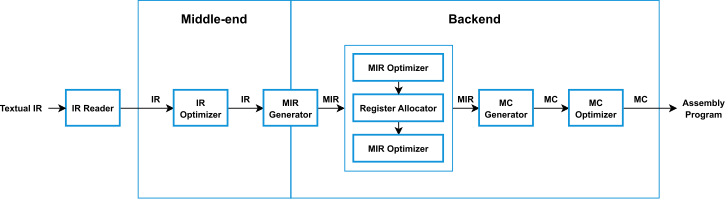

<div align="center">

# mini-llvm

**A minimal implementation of the LLVM core libraries and tools**

| main | develop |
|:-:|:-:|
| [](https://github.com/mini-llvm/mini-llvm/actions/workflows/build.yml?query=branch%3Amain) | [](https://github.com/mini-llvm/mini-llvm/actions/workflows/build.yml?query=branch%3Adevelop) |

</div>

## Table of Contents

- [Overview](#overview)
- [Components](#components)
- [Highlights](#highlights)
- [Design](#design)
- [Features](#features)
- [Usage](#usage)
- [Build](#build)
- [Testing](#testing)
- [Installation](#installation)
- [References](#references)
- [License](#license)

## Overview

**mini-llvm** is a minimal implementation of the LLVM core libraries and tools, supporting a strict subset of LLVM IR constructs. It aims to demonstrate the essential principles of modern compiler design in a clear, concise, and approachable way.

## Components

- The mini-llvm core library (`libmini-llvm`)
- The `mini-llc` command-line tool

## Highlights

- Modern C++ (C++23)
- Cross-platform compatibility (Linux & Windows)
- Easy integration (CMake & Bazel)
- No external dependencies

## Design



## Features

### Supported Targets

- `riscv64`

Although `riscv64` is currently the only supported target, the flexible architecture design of mini-llvm enables adding new targets with minimal effort.

### Supported IR Constructs

#### Types

- `void`
- Integer types
  - `i1`
  - `i8`
  - `i16`
  - `i32`
  - `i64`
- Floating-point types
  - `float`
  - `double`
- `ptr`
- Array types
- Function types
- `label`

#### Constants

- Integer constants
- Floating-point constants
- `null`
- Array constants
- `poison`

#### Instructions

- Terminators
  - `br`
  - `ret`
- Binary operators
  - Integer
    - Arithmetic
      - `add`
      - `sub`
      - `mul`
      - `sdiv`
      - `udiv`
      - `srem`
      - `urem`
      - `and`
      - `or`
      - `xor`
      - `shl`
      - `lshr`
      - `ashr`
    - Relational
      - `icmp`
  - Floating-point
    - Arithmetic
      - `fadd`
      - `fsub`
      - `fmul`
      - `fdiv`
      - `frem`
    - Relational
      - `fcmp`
- Unary operators
  - Floating-point
    - Arithmetic
      - `fneg`
- Casting operators
  - Integer
    - `trunc`
    - `sext`
    - `zext`
  - Floating-point
    - `fptrunc`
    - `fpext`
  - Integer ↔️ Floating-point
    - `sitofp`
    - `uitofp`
    - `fptosi`
    - `fptoui`
  - Pointer ↔️ Integer
    - `ptrtoint`
    - `inttoptr`
  - `bitcast`
- Memory management
  - `alloca`
  - `load`
  - `store`
  - `getelemenetptr`
- Other
  - `select`
  - `call`
  - `phi`

#### Attributes

- `alwaysinline`
- `argmemonly`
- `inaccessiblemem_or_argmemonly`
- `inaccessiblememonly`
- `noinline`
- `readnone`
- `readonly`

### Transform & Analysis Passes

#### IR-Level

- `AlgebraicSimplification`
- `ArrayFlattening`
- `AttributeDeduction`
- `BasicBlockMerging`
- `BranchSimplification`
- `ConstantFolding`
- `DeadCodeElimination`
- `DeadStoreElimination`
- `FunctionInlining`
- `GlobalCodeMotion`
- `GlobalDeadCodeElimination`
- `GlobalValueNumbering`
- `InstructionCombining`
- `JumpThreading`
- `Mem2Reg`
- `PoisonPropagation`
- `RedundantLoadElimination`
- `StrengthReduction`
- `TailCallElimination`
- `TailDuplication`
- `UnreachableBlockElimination`
- `AliasAnalysis`
- `DominatorTreeAnalysis`
- `LoopTreeAnalysis`

#### MIR-Level

- `BasicBlockMerging`
- `BasicBlockReordering`
- `CopyPropagation`
- `DeadCodeElimination`
- `JumpThreading`
- `NullOperationElimination`
- `RegisterReuse`
- `StackOffsetEvaluation`
- `TailDuplication`
- `UnreachableBlockElimination`
- `ZeroRegisterReplacement`
- `BranchPredictionAnalysis`
- `LiveVariableAnalysis`
- `RISCVConstantPropagation` (`riscv64`)

#### MC-Level

- `RISCVFallthrough` (`riscv64`)
- `RISCVUnusedLabelElimination` (`riscv64`)

### Register Allocators

- `GraphColoringAllocator`
- `LinearScanAllocator`
- `NaiveAllocator`

## Usage

<table>
<tr>
<td>add.ll</td>
</tr>
<tr>
<td>

```llvm
define i32 @add(i32 %0, i32 %1) {
2:
  %3 = add i32 %0, %1
  ret i32 %3
}
```

</td>
</tr>
</table>

<table>
<tr>
<td>main.ll</td>
</tr>
<tr>
<td>

```llvm
@scan_format = private constant [6 x i8] c"%d %d\00"
@print_format = private constant [14 x i8] c"%d + %d = %d\0A\00"

declare i32 @scanf(ptr, ...)
declare i32 @printf(ptr, ...)

declare i32 @add(i32, i32)

define i32 @main() {
0:
  %1 = alloca i32
  %2 = alloca i32
  %3 = call i32 @scanf(ptr @scan_format, ptr %1, ptr %2)
  %4 = load i32, ptr %1
  %5 = load i32, ptr %2
  %6 = call i32 @add(i32 %4, i32 %5)
  %7 = call i32 @printf(ptr @print_format, i32 %4, i32 %5, i32 %6)
  ret i32 0
}
```

</td>
</tr>
</table>

```sh
mini-llc --target riscv64 -o add.s add.ll
mini-llc --target riscv64 -o main.s main.ll
riscv64-linux-gnu-gcc -c -o add.o add.s
riscv64-linux-gnu-gcc -c -o main.o main.s
riscv64-linux-gnu-gcc -o example add.o main.o
qemu-riscv64 ./example
```

## Build

| Linux | macOS | Windows |
|:-:|:-:|:-:|
| ✅ | ✅ | ✅ |

| GCC | Clang | MSVC |
|:-:|:-:|:-:|
| ≥ 14 | ≥ 18 (libstdc++ ≥ 14, libc++ ❌*) | ≥ 19.42 (VS 2022 17.12) |

\* libc++ lacks support for certain C++23 features such as `std::move_only_function` and `std::views::enumerate`

| CMake | Bazel |
|:-:|:-:|
| ≥ 3.20 | ≥ 7.1 |

```sh
git clone --depth=1 --recurse-submodules --shallow-submodules <repo-url>
```

### With CMake

```sh
sudo apt-get update
sudo apt-get install -y g++-14 cmake ninja-build

cd <repo-dir>
mkdir build && cd build

cmake -DCMAKE_CXX_COMPILER=g++-14 -DCMAKE_BUILD_TYPE=Release -DMINI_LLVM_TESTS=ON -G Ninja ..
cmake --build .

./tools/mini-llc/mini-llc --help
```

| Build Option | Default | Description |
| - | - | - |
| `BUILD_SHARED_LIBS` | `OFF` | Build mini-llvm as a shared library (libmini-llvm.so) |
| `MINI_LLVM_TESTS` | `OFF` | Build tests |
| `MINI_LLVM_FUZZ` | `OFF` | Build fuzz targets |
| `MINI_LLVM_DOCS` | `OFF` | Build docs (requires Doxygen and Graphviz) |

### With Bazel

```sh
sudo apt-get update
sudo apt-get install -y g++-14

# Install Bazel: https://bazel.build/install/ubuntu

cd <repo-dir>

CC=gcc-14 CXX=g++-14 bazel build -c opt //...

./bazel-bin/tools/mini-llc/mini-llc --help
```

| Build Option | Default | Description |
| - | - | - |
| `shared` | `false` | Build mini-llvm as a shared library (libmini-llvm.so) |

## Testing

### Unit Tests

```sh
# CMake
cd <repo-dir>/build
ctest

# Bazel
cd <repo-dir>
CC=gcc-14 CXX=g++-14 bazel test -c opt //unittests:unittests
```

### Integration Tests

```sh
sudo apt-get update
sudo apt-get install -y gcc-riscv64-linux-gnu qemu-user

sudo mkdir -p /usr/gnemul
sudo ln -s /usr/riscv64-linux-gnu /usr/gnemul/qemu-riscv64

cd <repo-dir>/tests/mini-llc

# CMake
./test_all.sh \
  --mini-llc ../../build/bin/mini-llc \
  --target riscv64 \
  --driver riscv64-linux-gnu-gcc \
  --emulator qemu-riscv64

# Bazel
./test_all.sh \
  --mini-llc ../../bazel-bin/tools/mini-llc/mini-llc \
  --target riscv64 \
  --driver riscv64-linux-gnu-gcc \
  --emulator qemu-riscv64
```

## Installation

```sh
# CMake
cd <repo-dir>/build
cmake --install .
```

## References

- LLVM Language Reference Manual. https://llvm.org/docs/LangRef.html
- Cliff Click. 1995. Global code motion/global value numbering. In *Proceedings of the ACM SIGPLAN 1995 Conference on Programming Language Design and Implementation* (PLDI '95). Association for Computing Machinery, New York, NY, USA, 246–257. https://doi.org/10.1145/207110.207154
- Ron Cytron, Jeanne Ferrante, Barry K. Rosen, Mark N. Wegman, and F. Kenneth Zadeck. 1991. Efficiently computing static single assignment form and the control dependence graph. *ACM Trans. Program. Lang. Syst.* 13, 4 (Oct. 1991), 451–490. https://doi.org/10.1145/115372.115320
- Torbjörn Granlund and Peter L. Montgomery. 1994. Division by invariant integers using multiplication. In *Proceedings of the ACM SIGPLAN 1994 Conference on Programming Language Design and Implementation* (PLDI '94). Association for Computing Machinery, New York, NY, USA, 61–72. https://doi.org/10.1145/178243.178249
- Thomas Lengauer and Robert Endre Tarjan. 1979. A fast algorithm for finding dominators in a flowgraph. *ACM Trans. Program. Lang. Syst.* 1, 1 (Jan. 1979), 121–141. https://doi.org/10.1145/357062.357071
- Massimiliano Poletto and Vivek Sarkar. 1999. Linear scan register allocation. *ACM Trans. Program. Lang. Syst.* 21, 5 (Sept. 1999), 895–913. https://doi.org/10.1145/330249.330250

## License

mini-llvm is licensed under the [MIT license](https://opensource.org/licenses/MIT).
